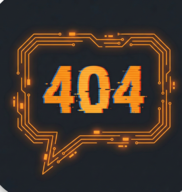

<div align="center">



# 🗣️ Say 404

### The Ultimate Pocket Companion for Modern Hotel Animators

Break language barriers, run your daily activities, and never lose the beat — **online or offline**.

[](https://3mmar404.github.io/Say-404/)
[](#-tech-stack)
[](#-installing-as-an-app-pwa)
[](#-features)
[](./LICENSE)

**🔗 [Live Demo →](https://3mmar404.github.io/Say-404/)**

</div>

---

## 📖 Overview

**Say 404** is a Progressive Web App (PWA) built for hotel animation & entertainment teams. Whether you need a welcome script in Italian, a step-by-step stretching routine, or a quick Zumba playlist, Say 404 puts it all in your pocket — and it keeps working even when the Wi-Fi doesn't.

Built with plain HTML, CSS, and JavaScript (no frameworks, no build step) and powered by simple JSON files, it's fast, lightweight, and easy to extend.

## 📑 Table of Contents

- [Features](#-features)
- [Tech Stack](#-tech-stack)
- [Project Structure](#-project-structure)
- [Getting Started](#-getting-started)
- [Installing as an App (PWA)](#-installing-as-an-app-pwa)
- [How to Use](#-how-to-use)
- [Content & Data](#-content--data)
- [Contributing](#-contributing)
- [License](#-license)
- [Author](#-author)
- [نبذة بالعربي](#-نبذة-بالعربي)

## ✨ Features

- **🌍 Multi-Language Support** — Instant scripts in **English, Italian, German, Russian, and Spanish**. Tap a flag to switch instantly.
- **📚 Smart Library** — A large collection of phrases organized by topic (Greetings, Small Talk, Hospital, and more), with **Slang** and **Formal** filters.
- **💃 Activity Hub** — Move-by-move guides for activities like Step Aerobics, Zumba, Yoga, and Mini Disco.
- **🎵 Smart Music** — Curated playlists with direct YouTube search links for every track.
- **⚡ Offline Ready** — As a PWA it works perfectly with no internet after the first load.
- **🎨 Modern UI** — Sleek dark-mode design with glassmorphism effects and smooth accordion navigation.
- **📝 Personal Notes** — Save your own custom phrases locally on your device.

## 🛠️ Tech Stack

| Layer | Technology |
|-------|-----------|
| **Core** | HTML5, CSS3 (Custom Properties, Flexbox), Vanilla JavaScript (ES6+) |
| **Data** | JSON-based architecture for easy content management |
| **Storage** | `localStorage` for user notes |
| **Offline** | Service Worker (cache-first strategy) |
| **Design** | Custom CSS with glassmorphism + fully responsive layout |

No build tools, no dependencies — just open and go.

## 📂 Project Structure

```
Say-404/
├── index.html          # Main application shell
├── style.css           # Styling, theming & animations
├── app.js              # Core logic & rendering engine
├── sw.js               # Service Worker (offline caching)
├── manifest.json       # PWA manifest (icons, theme, display)
├── library.json        # Database of translated phrases
├── activities.json     # Database of activities & music
├── content_en.json     # Script module — English
├── content_it.json     # Script module — Italian
├── content_de.json     # Script module — German
├── content_ru.json     # Script module — Russian
├── content_es.json     # Script module — Spanish
├── icon.png            # App icon (192×192)
└── icon512.png         # App icon (512×512)
```

## 🚀 Getting Started

Say 404 is a static PWA, but it must be served over **HTTP** (not opened as a `file://`) so the Service Worker and `fetch` calls work.

**1. Clone the repository**

```bash
git clone https://github.com/3mmar404/Say-404.git
cd Say-404
```

**2. Serve it locally** with any static server, e.g.:

```bash
# Using Python 3
python3 -m http.server 8080

# …or using Node.js
npx serve .
```

**3. Open** [`http://localhost:8080`](http://localhost:8080) in your browser.

> 💡 Prefer zero setup? Just open the **[Live Demo](https://3mmar404.github.io/Say-404/)**.

## 📱 Installing as an App (PWA)

1. Open the [Live Demo](https://3mmar404.github.io/Say-404/) (or your local server) in a modern browser.
2. **Mobile:** tap the browser menu → **Add to Home Screen**.
3. **Desktop (Chrome/Edge):** click the **Install** icon in the address bar.
4. Launch it like a native app — it runs standalone and works offline. 🎉

## 🎯 How to Use

1. **Select Language** — Tap the flag icon to switch between 5 languages instantly.
2. **Browse Scripts** — Use the **Library** to find the perfect phrase for any situation.
3. **Lead Activities** — Open the **Activs** tab for move-by-move guides and music cues.
4. **Save Notes** — Keep your own custom phrases stored locally.
5. **Install** — Add it to your home screen for native-app-like use.

## 🗃️ Content & Data

All content lives in plain JSON, so you can add or edit phrases and activities without touching the app logic:

- `library.json` — topic-categorized phrases (with Slang/Formal variants).
- `activities.json` — activities and their music cues.
- `content_<lang>.json` — the script module for each language.

Edit the relevant file, reload, and your changes appear instantly.

## 🤝 Contributing

Contributions are welcome! If you have new scripts, translations, or activities to add:

1. **Fork** the repository.
2. Create a branch: `git checkout -b feature/my-addition`.
3. Add your content to the relevant JSON file(s).
4. **Commit** your changes: `git commit -m "Add: new Italian greetings"`.
5. **Push** and open a **Pull Request**.

Please keep JSON valid and follow the existing structure.

## 📄 License

This project is licensed under the **MIT License** — see the [LICENSE](./LICENSE) file for details.

## 👤 Author

**Ammar** ([@3mmar404](https://github.com/3mmar404))

Developed with ❤️ for animators around the world.

---

## 🌐 نبذة بالعربي

**Say 404** هو تطبيق ويب تقدّمي (PWA) مصمّم لفرق الأنيميشن والترفيه في الفنادق. بيساعدك تكسر حاجز اللغة وتدير أنشطتك اليومية بسهولة — وبيشتغل حتى من غير إنترنت بعد أول تحميل.

### أهم المميزات

- **🌍 دعم 5 لغات:** إنجليزي، إيطالي، ألماني، روسي، وإسباني — بتبديل فوري بضغطة على العلم.
- **📚 مكتبة ذكية:** مجموعة كبيرة من الجُمل مقسّمة حسب الموضوع (ترحيب، دردشة، طوارئ… إلخ) مع فلاتر "عامّية" و"رسمي".
- **💃 مركز الأنشطة:** أدلة خطوة بخطوة لأنشطة زي Step Aerobics و Zumba و Yoga و Mini Disco.
- **🎵 موسيقى ذكية:** قوائم تشغيل مع روابط بحث مباشرة على YouTube لكل أغنية.
- **⚡ يعمل أوفلاين:** بيشتغل بكفاءة من غير نت بعد أول فتح.
- **🎨 واجهة عصرية:** تصميم Dark Mode مع تأثيرات Glassmorphism وتنقّل سلس.
- **📝 ملاحظات شخصية:** احفظ جُملك الخاصة محليًا على جهازك.

### طريقة التشغيل محليًا

التطبيق لازم يشتغل عبر خادم HTTP (مش بفتح الملف مباشرة) عشان الـ Service Worker يشتغل صح:

```bash
git clone https://github.com/3mmar404/Say-404.git
cd Say-404
python3 -m http.server 8080
```

بعدها افتح `http://localhost:8080` في المتصفّح — أو جرّب النسخة المباشرة: **[Live Demo](https://3mmar404.github.io/Say-404/)**.

### المساهمة

المساهمات مرحّب بيها! اعمل Fork، أضف محتواك في ملفات الـ JSON، وافتح Pull Request. خلّي الـ JSON صحيح ومتوافق مع البنية الحالية.

### الرخصة

المشروع مرخّص تحت رخصة **MIT** — التفاصيل في ملف [LICENSE](./LICENSE).

---

<div align="center">

Made with ❤️ by <a href="https://github.com/3mmar404">Ammar</a> · for animators everywhere

</div>
