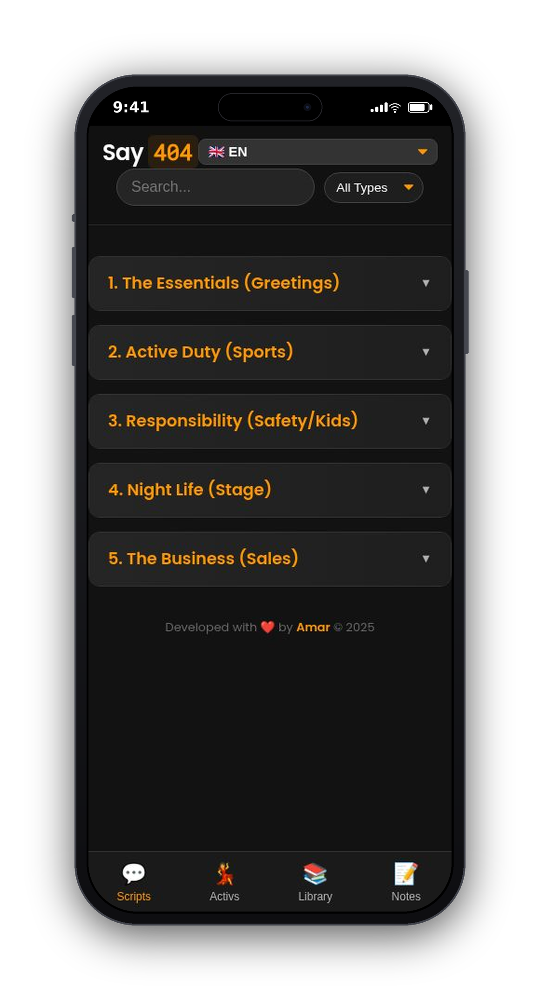
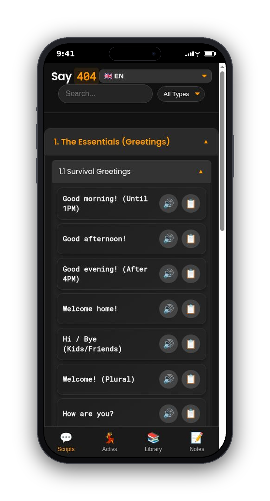
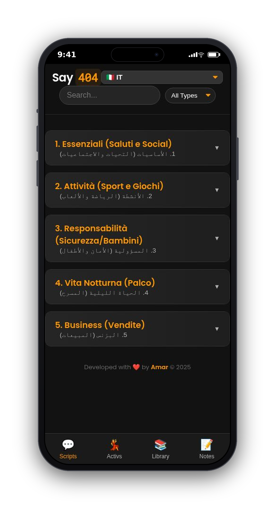
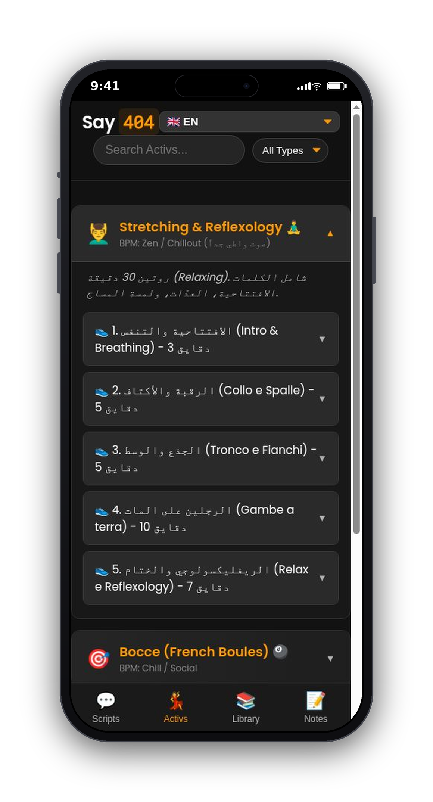
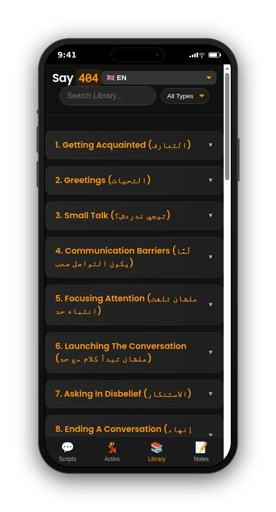
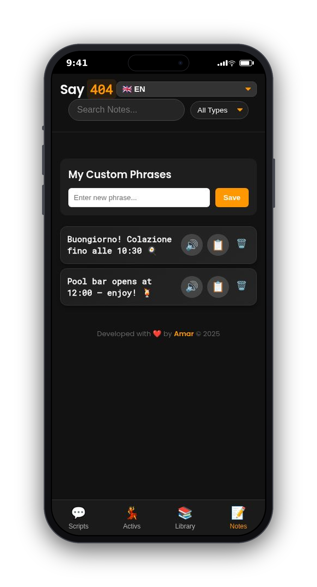

# 🗣️ Say 404

> **The Ultimate Pocket Companion for Modern Hotel Animators.**

**Say 404** is a Progressive Web App (PWA) designed to help animation teams break language barriers and manage daily activities efficiently. Whether you need a script in Italian, a stretching routine, or a quick Zumba playlist, Say 404 has you covered—even offline.

🔗 **Live Demo:** [https://3mmar404.github.io/Say-404/](https://3mmar404.github.io/Say-404/)

## 📸 Screenshots

<table>
  <tr>
    <td align="center" width="33%">
       
      <b>💬 Scripts Hub</b> Categorized scripts, ready on tap
    </td>
    <td align="center" width="33%">
       
      <b>🗣️ Instant Phrases</b> Tap to hear or copy any line
    </td>
    <td align="center" width="33%">
       
      <b>🌍 5 Languages</b> Switch instantly (Italian shown)
    </td>
  </tr>
  <tr>
    <td align="center" width="33%">
       
      <b>💃 Activity Hub</b> Move-by-move guides &amp; music cues
    </td>
    <td align="center" width="33%">
       
      <b>📚 Smart Library</b> Hundreds of categorized phrases
    </td>
    <td align="center" width="33%">
       
      <b>📝 Personal Notes</b> Save your own phrases locally
    </td>
  </tr>
</table>

## ✨ Key Features

* **🌍 Multi-Language Support:** Instant translation for scripts in English, Italian, German, Russian, and Spanish.
* **📚 Smart Library:** A vast collection of phrases categorized by topic (Greetings, Small Talk, Hospital, etc.) with "Slang" and "Formal" filters.
* **💃 Activity Hub:** Detailed guides for activities like Step Aerobics, Zumba, Yoga, and Mini Disco.
* **🎵 Smart Music:** Integrated playlists with direct YouTube search links for every track.
* **⚡ Offline Ready:** Built as a PWA, it works perfectly without an internet connection after the first load.
* **🎨 Modern UI:** Sleek Dark Mode design with Glassmorphism effects and smooth accordion navigation.
* **📝 Personal Notes:** Save your own custom phrases locally.

## 🛠️ Tech Stack

* **Core:** HTML5, CSS3 (Variables, Flexbox), Vanilla JavaScript (ES6+).
* **Data:** JSON-based architecture for easy content management.
* **Storage:** LocalStorage for user notes.
* **Design:** Custom CSS with Glassmorphism and responsive layout.

## 🚀 How to Use

1.  **Select Language:** Tap the flag icon to switch between 5 languages instantly.
2.  **Browse Scripts:** Use the **Library** to find the perfect phrase for any situation.
3.  **Lead Activities:** Open the **Activs** tab to see move-by-move guides and music cues.
4.  **Install:** Add to your home screen to use it like a native app.

## 📂 Project Structure

Say-404/ ├── index.html # Main application structure ├── style.css # Custom styling & animations ├── app.js # Core logic & rendering engine ├── sw.js # Service Worker for offline support ├── library.json # Database of translated phrases ├── activities.json # Database of activities & music └── content_*.json # Script modules for each language

## 🤝 Contributing

Contributions are welcome! If you have new scripts or activities to add:
1.  Fork the repository.
2.  Add your content to the JSON files.
3.  Submit a Pull Request.

---

Developed with Amar ❤️ for Animators.

